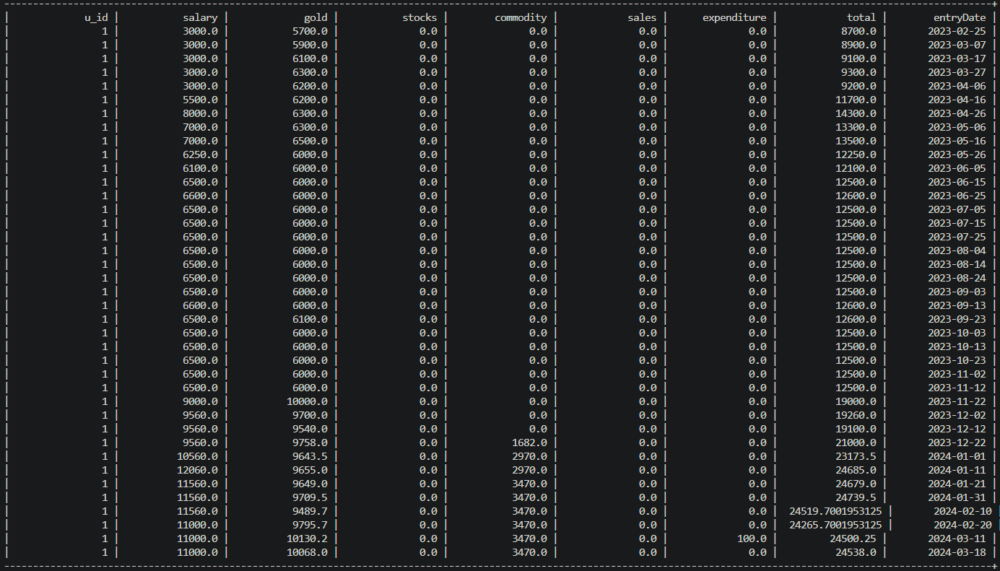

## Personal Finance Tracker & Data Visualisation Software

>Technologies used: 

 

 

### What does this software do?
- This software can be used to visualise data in many forms.
- It allows the user to download the generated charts.
- It can be used as a finance tracker, providing various useful outputs.
- The data can also be stored for later use.

### Preview

Visualised Data

Relational Data

### Entity Relationship Diagram for Finance Tracker

---

Designed & Developed by [Tejas](https://github.com/multiverseweb).
