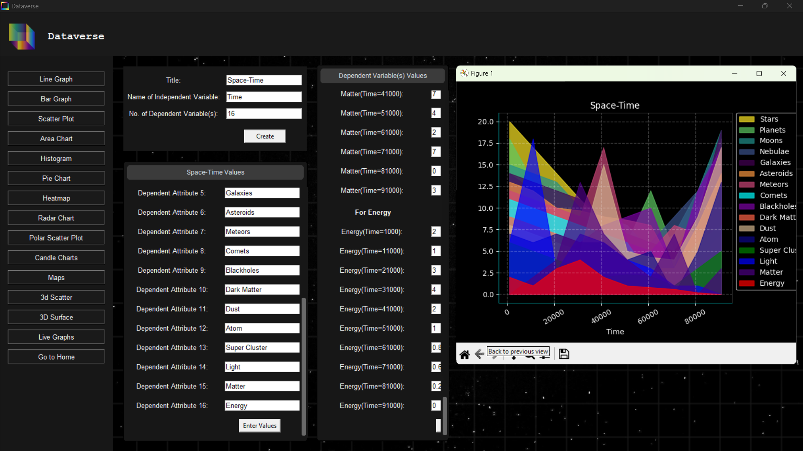
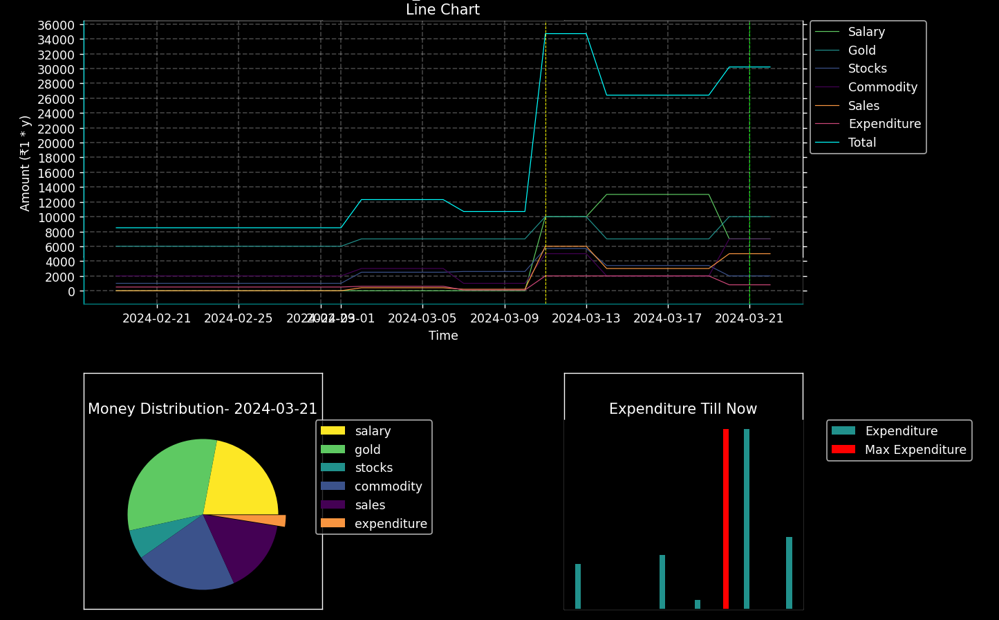

# GSSoc'24  <a href="https://codeittool.netlify.app">Extended</a>

## Tech Stack


 


 
 

 


#### Read the description below and [start contributing](#contributions) now! If you like the project, show some love ❤️ and star the repo! ⭐
---

# Dataverse


###### Data Visualisation Software & Personal Finance Tracker

---

[](/LICENSE#L3)


### Table of Contents

| [About Dataverse](#what-does-this-software-do) | [Use Dataverse](#deployment-specifications) | [Preview](#preview) | [Software Representation](#software-representation) | [Technologies Used](#technologies-used) | [Make Contributions](#contributions) | [Website](#website) |
|:--:|:--:|:--:|:--:|:--:|:--:|:--:|

---

### What does this software do?
- This software can be used to visualise data in many basic as well as advanced forms.
- It allows the user to download the generated charts.
- It can be used as a finance tracker, providing various useful outputs.
- It supports data inputs from excel sheets.
- The data can also be stored for later use.
- Uses encryption techniques to securely store your passwords.

---

### Deployment Specifications

Dataverse is currently under development. It will be available for installastion soon.

However, you can follow these steps to run the project locally on your computer:
> [!IMPORTANT]
> Don't forget to read the [prerequisites](#prerequisites).


   - Clone the project
   
      ```
     git clone https://github.com/multiverseweb/Dataverse.git
      ```

   -  Open `software` folder in VSCode.

      ```
      cd Dataverse/software
      ```

   - Go to `mainGUI.py` and run it.

Now the software should run locally with no errors, feel free to use the software and don't forget to give feedback on the [website](https://multiverse-dataverse.netlify.app/)!

---

### Prerequisites
<highlight>For Data Visualization</highlight>
- You must have a python interpreter installed on your computer.
- You must have python packages such as `numpy, pandas, matplotlib, tkinter`.

  ```
  pip install package_name
  ```
<highlight>For Finance Tracker</highlight>
- For using the Finance Tracker, you must have `MySQL` installed on your computer. If you don't have it you can download it from [here](https://dev.mysql.com/downloads/installer/).
- Go to `line no. 15` under `connecting MySQL` section of `financeTracker.py` and change the values of `host, user and passwd` according to your MySQL account.
- Also, run the command
  ```
  CREATE DATABASE FINANCE;
  ```
  on your MySQL workbench or commandline client.

---

### Preview
<sup><a href="#table-of-contents" align="right">Back to top</a></sup>
<div align=center>

Software GUI
<br>

<br><br>
<details> 
 <summary align=left><H4>View More</H4></summary><br>
Visualised Finance Data
<br>

<br><br>
Relational Data
<br>

</details>
</div>

---

### Software Representation
<sup><a href="#table-of-contents" align="right">Back to top</a></sup>

ER Diagram for Finance Tracker


---

### Technologies used
<sup><a href="#table-of-contents" align="right">Back to top</a></sup>


 


 
 

 


---
### Contributions
<sup><a href="#table-of-contents" align="right">Back to top</a></sup>

Want to show yourself on the contributions-map?

- Contribute to this project.

> [!IMPORTANT]
> Create a new branch `gssoc-yourName` before sending the Pull Request.
- Go to [issues](https://github.com/multiverseweb/Dataverse/issues), resolve the one that you can or create a new issue.
- Go to [`line no. 1` in script.js](https://github.com/multiverseweb/Dataverse/blob/main/website/script.js#L1-L2).
- Append the name of your city to the `cities` array.
- Create a `pull-request` so I can review and merge it.

---
### Website

Deployed on


You can visit the live site for Dataverse and related tools [here](https://multiverse-dataverse.netlify.app/).


<sup><a href="#table-of-contents" align="right">Back to top</a></sup>

<h1>Our Valuable Contributors ❤️✨</h1>

[](https://github.com/multiverseweb/Dataverse/graphs/contributors)
 
