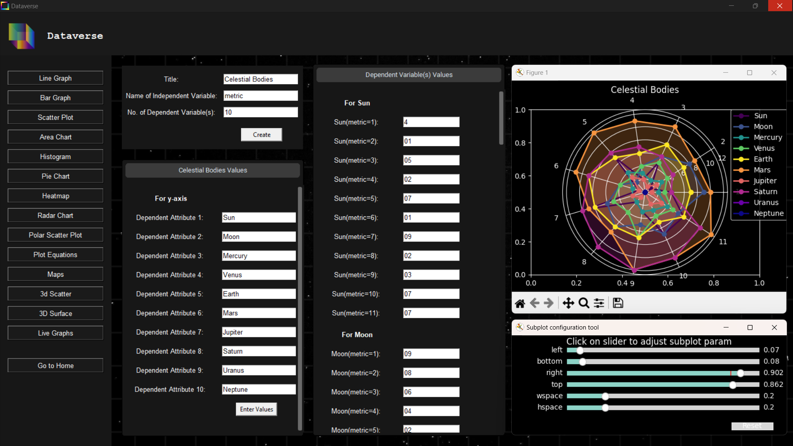
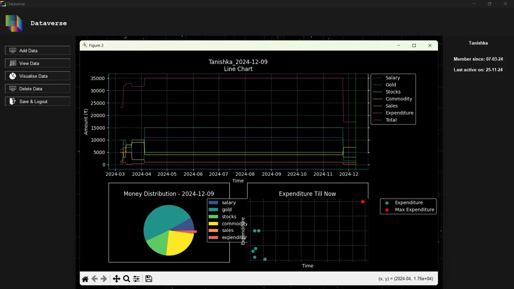
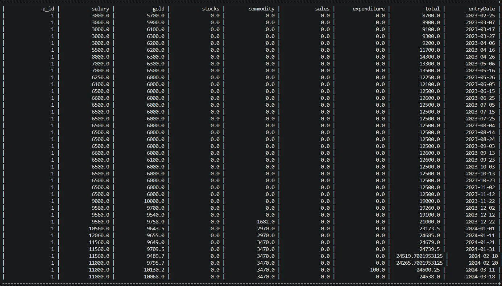

# Dataverse


###### Data Visualisation Software & Finance Tracker

<!---->


  
  
  
  
  
  
  
  
  
  
  
  
  <a href="https://multiverse-dataverse.netlify.app/">
</a>

---

### Table of Contents

<table>
  <tr>
    <th><a href="#what-does-this-software-do">About Dataverse</a></th>
    <th><a href="#versions">Versions</a></th>
    <th><a href="#deployment-specifications">Use Dataverse</a></th>
    <th><a href="#repository-structure">Repository Structure</a></th>
    <th><a href="#preview">Application Preview</a></th>
    <th><a href="#contributions">Make Contributions</a></th>
    <th><a href="#website">Website</a></th>
  </tr>
</table>

---

### Featured In

<table>
<tr>
      <th>Event Logo</th>
      <th>Event Name</th>
    </tr>
<tr>
        <td></td>
        <td><a href="https://www.socialwinterofcode.com/">Social Winter of Code Season-5 (SWOC) </a>2024-2025</td>
    </tr>
    <tr>
        <td></td>
        <td><a href="https://gssoc.girlscript.tech/">GirlScript Summer of Code Ext (GSSoC'24) </a>2024</td>
    </tr>
   <tr>
        <td></td>
        <td><a href="https://hacktoberfest.com/">Hacktober Fest</a> 2024</td>
    </tr>
</table>

### What does this software do?
- Supports all data visualisation techniques, basic as well as advanced.
- Generates interactive, customizable and exportable graphs.
- Provides data storage for later use.
- Supports data inputs from excel sheets.
- Simplifies expense tracking and financial management.
- Allows user to download financial reports.
- Uses encryption techniques to securely store your passwords.
- View and manage data via a mobile-friendly website.
- Provides predictive analytics and trend analysis using ML techniques.

---
### Versions

| Version | Description |
|-------------|-----------------|
| v.XM45'24 `Under Development` | High scale installable vesrion currently being developed, has improved UI based on glassmorphism. Makes the project mobile-friendly and provides more analytical features. Seeks major contributions through SWOC-S5. |
| v.6550(24) `Latest` | Current stable version that supports most of the data visualisation techniques and finance tracking. Major development done during GSSoC'24. |
| v.06.02.24 | Initial version developed on 6th February, 2024. Only supports finance tracking. |


---

### Deployment Specifications

Dataverse is currently under development. It will be available for installastion soon.

However, you can follow these steps to run the project locally on your computer:
> [!IMPORTANT]
> Don't forget to read the [prerequisites](#prerequisites).


   - Clone the project
   
      ```
     git clone https://github.com/multiverseweb/Dataverse.git
      ```

   -  Open `software` folder in VSCode.

      ```
      cd Dataverse/software
      ```

   - Go to `main.py` and run it.

Now the software should run locally with no errors, feel free to use the software and don't forget to give feedback on the [website](https://multiverse-dataverse.netlify.app/)!

---

### Prerequisites
<highlight>For Data Visualization</highlight>
- You must have a python interpreter installed on your computer.
- You must have python packages such as `numpy, pandas, matplotlib, tkinter`.

  ```
  pip install package_name
  ```
<highlight>For Finance Tracker</highlight>
- For using the Finance Tracker, you must have `MySQL` installed on your computer. If you don't have it you can download it from [here](https://dev.mysql.com/downloads/installer/).
- Go to `line no. 15` under `connecting MySQL` section of `financeTracker.py` and change the values of `host, user and passwd` according to your MySQL account.
- Also, run the command
  ```
  CREATE DATABASE DATAVERSE;
  ```
  on your MySQL workbench or commandline client.

---

### Repository Structure

| [**📂 View _Repository Structure_**](/Documentation/PROJECT_STRUCTURE.md) |
|-|

---

### Preview
<div align=center>

Software GUI
<br>

<br><br>
<details> 
 <summary align=left><H4>View More</H4></summary><br>
Visualised Finance Data
<br>

<br><br>
Relational Data
<br>

</details>
</div>

---

### Star History

<picture>
  <source
    media="(prefers-color-scheme: dark)"
    srcset="
      https://api.star-history.com/svg?repos=multiverseweb/Dataverse&type=Date&theme=dark
    "
  />
  
  <source
    media="(prefers-color-scheme: light)"
    srcset="
      https://api.star-history.com/svg?repos=multiverseweb/Dataverse&type=Date
    "
  />
  
</picture>

### Contributions

Want to contribute to this project? Follow these steps:

- Star the Repository.
- Go to [issues](https://github.com/multiverseweb/Dataverse/issues), find an issue that you can solve or create a new issue.
- Fork the repository.
- Create a new branch (`git checkout -b feature-branch`).
- Go to [`line no. 1` in script.js](https://github.com/multiverseweb/Dataverse/blob/main/website/scripts/script.js#L5-L7) and append the name of your city to the `cities` array. (optional)
- Make your contributions and commit them (`git commit -m 'Add feature'`).
- Push to the branch (`git push origin feature-branch`).
- Create a Pull Request, so I can review and merge it.


### Our Valuable Contributors ❤️✨

[](https://github.com/multiverseweb/Dataverse/graphs/contributors)


### Stargazers ❤️

<div align='left'>

[](https://github.com/multiverseweb/Dataverse/stargazers)


</div>

### Forkers ❤️

[](https://github.com/multiverseweb/Dataverse/network/members)

---
 
### Website
|<a href="https://multiverse-dataverse.netlify.app/"></a>|[Visit Dataverse's Website](https://multiverse-dataverse.netlify.app/)|
|-|-|


<sup><a href="#table-of-contents" align="right">Back to top</a></sup>

```

```
